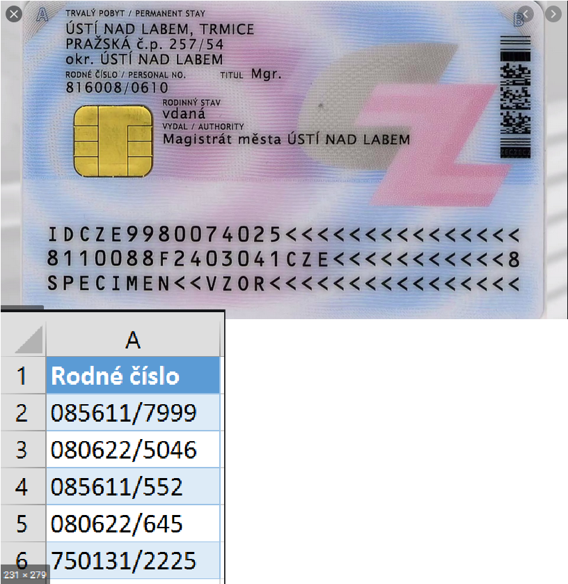

# Czech National ID reader
this program takes the input number from the user and generates the date of birth and gender information from it.

Here are some examples of how the number looks like:

You can find next examples from the Czech ID numbers here: https://www.google.com/search?q=rodn%C3%A9+%C4%8D%C3%ADslo&client=firefox-b-d&sxsrf=ALeKk00eVp_hBIHaMocG3wZYwayQrZq89A:1592068900525&source=lnms&tbm=isch&sa=X&ved=2ahUKEwjW4pfqpv_pAhWQyKQKHQiVB0gQ_AUoAXoECBIQAw&biw=1920&bih=966
